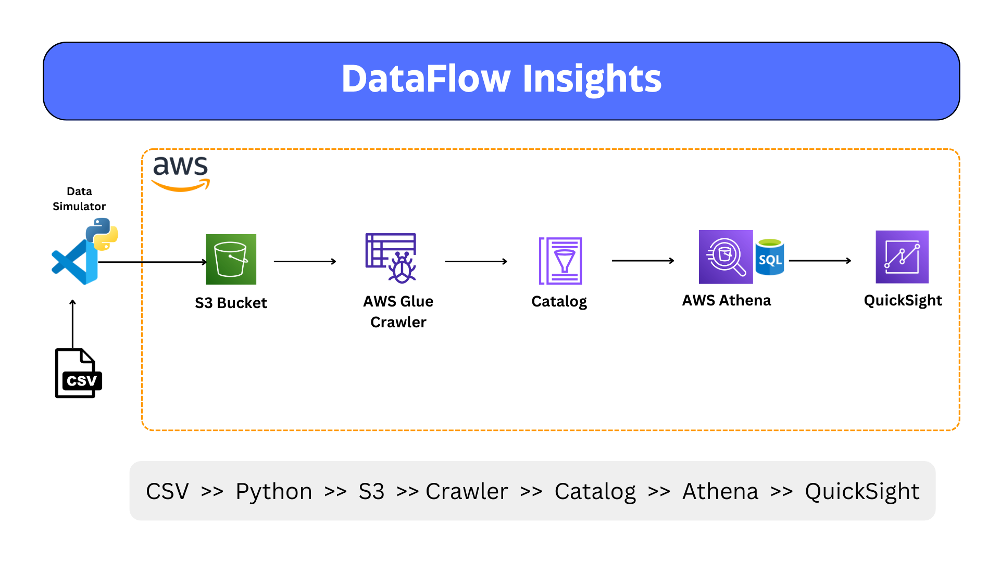

<h1 align="center">📊 DataFlow Insights</h1>

<p align="center">
  <strong>Cloud data engineering pipeline for batch ingestion, cataloging, SQL analysis, and BI dashboards using Python and AWS.</strong>
</p>

<p align="center">
  
  
  
  
  
  
  
</p>

<p align="center">
  <strong>Data Engineering • AWS Data Lake • ETL/ELT • Analytics Pipeline • Business Intelligence</strong>
</p>

---

## 🚀 Project Overview

**DataFlow Insights** is a practical data engineering project that demonstrates how raw retail order data can be prepared, uploaded, cataloged, queried, and visualized using a modern AWS analytics workflow.

The project starts with a structured **Superstore sales dataset**, processes it with **Python and Pandas**, splits the data into daily order snapshots, uploads the generated files to **Amazon S3**, catalogs them using **AWS Glue**, queries them with **Amazon Athena**, and supports dashboard reporting through **Amazon QuickSight**.

This project is designed to show job-ready understanding of:

- Data ingestion from local files to cloud storage
- Batch data processing with Python
- Cloud data lake organization using S3 prefixes
- Metadata cataloging with AWS Glue
- Serverless querying with Athena
- Business dashboarding with QuickSight
- Secure configuration using environment variables

---

## 🏗️ Architecture



```text
Superstore CSV Dataset
        |
        v
Python + Pandas Processing
        |
        v
Daily Order Snapshot CSV Files
        |
        v
Amazon S3 Data Lake
        |
        v
AWS Glue Crawler + Data Catalog
        |
        v
Amazon Athena SQL Queries
        |
        v
Amazon QuickSight Dashboard
```

---

## 🧩 Core Components

| Layer | Technology | Purpose |
|---|---|---|
| 📁 Source Data | Superstore CSV | Raw structured retail order dataset |
| 🐍 Processing | Python, Pandas | Reads, validates, transforms, and splits order data |
| ☁️ Storage | Amazon S3 | Stores daily snapshots in a cloud data lake structure |
| 🧾 Metadata | AWS Glue Crawler | Detects schema and creates metadata tables |
| 🔎 Query Engine | Amazon Athena | Runs SQL queries directly on S3 data |
| 📊 Visualization | Amazon QuickSight | Builds business intelligence dashboards |

---

## 🔄 Workflow

1. **Load Raw Dataset**
   - The pipeline reads the Superstore CSV dataset from the local `datasets` folder.
   - The script automatically detects common file encodings and date columns.

2. **Clean and Split Data**
   - Invalid date rows are skipped safely.
   - Valid records are grouped by order date.
   - One daily CSV snapshot is generated for each order date.

3. **Upload to Amazon S3**
   - Daily snapshot files are uploaded to a configured S3 bucket and prefix.
   - The files are stored in a format suitable for downstream analytics.

4. **Catalog with AWS Glue**
   - AWS Glue crawls the S3 data.
   - The Glue Data Catalog stores schema metadata for querying.

5. **Query with Amazon Athena**
   - Athena allows SQL-based analysis directly on the S3 dataset.
   - No database server is required.

6. **Visualize with QuickSight**
   - QuickSight connects to Athena.
   - Dashboards can show sales, profit, region, category, customer segment, and order trends.

---

## ✨ Key Features

- ✅ Automated CSV splitting by order date
- ✅ Chunk-based processing for larger datasets
- ✅ Encoding detection for real-world CSV compatibility
- ✅ Dynamic date-column detection
- ✅ Safe handling of invalid dates
- ✅ S3 upload automation using Boto3
- ✅ AWS Glue + Athena-ready data lake workflow
- ✅ QuickSight-ready analytics layer
- ✅ Environment-based configuration for safer GitHub publishing
- ✅ Clean project setup for portfolio and job applications

---

## 📂 Project Structure

```text
DataFlow Insights/
├── Architecture-Diagram.png
├── README.md
├── LICENSE
├── .gitignore
├── .env.example
├── requirements.txt
├── split_orders_by_date.py
├── run_and_upload_to_s3.py
└── datasets/
    ├── Superstore.csv
    └── orders_YYYY_MM_DD.csv    # generated daily snapshots
```

> The generated `orders_YYYY_MM_DD.csv` files are ignored by `.gitignore` by default to keep the GitHub repository clean. You can regenerate them by running the processing script.

---

## 🛠️ Tech Stack

- **Python 3.x**
- **Pandas**
- **Boto3**
- **Amazon S3**
- **AWS Glue**
- **AWS Glue Data Catalog**
- **Amazon Athena**
- **Amazon QuickSight**

---

## ⚙️ Setup Instructions

### 1. Clone the Repository

```bash
git clone https://github.com/CodeByMan/Dataflow-Insights.git
cd Dataflow-Insights
```

### 2. Create a Virtual Environment

```bash
python -m venv .venv
```

Activate it:

```bash
# Windows
.venv\Scripts\activate

# macOS/Linux
source .venv/bin/activate
```

### 3. Install Dependencies

```bash
pip install -r requirements.txt
```

### 4. Configure Environment Variables

Create a `.env` file from the sample file:

```bash
cp .env.example .env
```

Update the values in `.env`:

```env
AWS_REGION=us-east-1
S3_BUCKET_NAME=your-s3-bucket-name
S3_PREFIX=orders/
INPUT_CSV=datasets/Superstore.csv
OUTPUT_DIRECTORY=datasets
```

> Do not commit `.env` to GitHub. It is ignored by `.gitignore`.

---

## ▶️ How to Run

### Generate Daily Order Snapshot Files

```bash
python split_orders_by_date.py
```

You can also provide a custom CSV path:

```bash
python split_orders_by_date.py datasets/Superstore.csv
```

### Upload Generated Files to Amazon S3

Make sure your AWS credentials are configured first:

```bash
aws configure
```

Then run:

```bash
python run_and_upload_to_s3.py
```

The script uploads generated daily files to:

```text
s3://your-s3-bucket-name/orders/
```

---

## 🔎 Example Athena Queries

### Total Sales and Profit

```sql
SELECT
  ROUND(SUM(sales), 2) AS total_sales,
  ROUND(SUM(profit), 2) AS total_profit
FROM orders;
```

### Sales by Region

```sql
SELECT
  region,
  ROUND(SUM(sales), 2) AS total_sales,
  ROUND(SUM(profit), 2) AS total_profit
FROM orders
GROUP BY region
ORDER BY total_sales DESC;
```

### Top Product Categories

```sql
SELECT
  category,
  sub_category,
  ROUND(SUM(sales), 2) AS total_sales,
  ROUND(SUM(profit), 2) AS total_profit
FROM orders
GROUP BY category, sub_category
ORDER BY total_sales DESC;
```

---

## 📊 Dashboard Insights

A QuickSight dashboard can be built on top of Athena to analyze:

- Total sales and profit
- Monthly sales trends
- Category and sub-category performance
- Regional revenue distribution
- Customer segment analysis
- Discount impact on profit
- Top-performing products

---

## 🔐 Security Notes

- AWS credentials should be configured through AWS CLI, IAM roles, or environment variables.
- Do not commit `.env`, access keys, secret keys, or account-specific configuration.
- Use least-privilege IAM permissions for S3, Glue, Athena, and QuickSight.
- Use a separate S3 bucket or prefix for development and production data.

---

## 🧠 What I Learned

Through this project, I practiced:

- Building a cloud-based analytics pipeline
- Preparing structured data for cloud ingestion
- Working with S3 as a data lake storage layer
- Using Glue crawlers for schema discovery
- Running SQL analytics with Athena
- Connecting cloud data to BI dashboards
- Designing a simple but realistic data engineering workflow

---

## 👤 Author

**Muhammad Ali Nawaz**  
Cloud Data Engineer

---

## 📄 License

This project is licensed under the [MIT license](LICENSE).

---

<p align="center">
  <b>⭐ If you like this project, consider starring the repository!</b>
</p>
